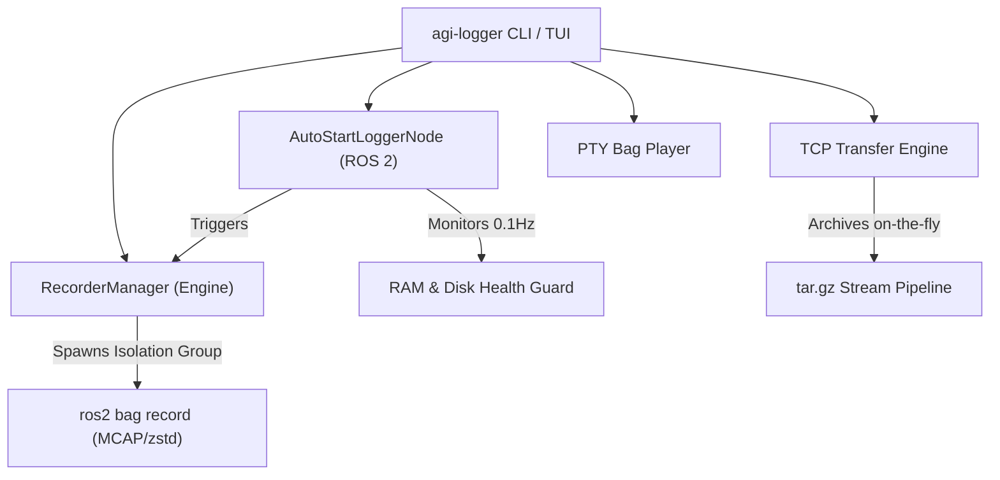

# Agipix Logger (`agi-logger`)

```
      █████╗  ██████╗ ██╗██████╗ ██╗██╗  ██╗ 
     ██╔══██╗██╔════╝ ██║██╔══██╗██║╚██╗██╔╝ 
     ███████║██║  ███╗██║██████╔╝██║ ╚███╔╝  
     ██╔══██║██║   ██║██║██╔═══╝ ██║ ██╔██╗  
     ██║  ██║╚██████╔╝██║██║     ██║██╔╝ ██╗ 
     ╚═╝  ╚═╝ ╚═════╝ ╚═╝╚═╝     ╚═╝╚═╝  ╚═╝ 

██╗      ██████╗  ██████╗  ██████╗ ███████╗██████╗ 
██║     ██╔═══██╗██╔════╝ ██╔════╝ ██╔════╝██╔══██╗
██║     ██║   ██║██║  ███╗██║  ███╗█████╗  ██████╔╝
██║     ██║   ██║██║   ██║██║   ██║██╔══╝  ██╔══██╗
███████╗╚██████╔╝╚██████╔╝╚██████╔╝███████╗██║  ██║
╚══════╝ ╚═════╝  ╚═════╝  ╚═════╝ ╚══════╝╚═╝  ╚═╝
    Advanced ROS 2 Logging & Transfer Engine for Agipix Platform
```

`agi-logger` is a production-grade, robotics-focused telemetry recording and transport utility for ROS 2. It provides high-performance `rosbag2` recording (with MCAP and ZSTD compression), autonomous arm/disarm-triggered lifecycle management, live system health monitoring (RAM/Disk at 0.1 Hz), an interactive TUI, and socket-level TCP multi-bag batch transfer.

---

## ⚡ One-Liner Command Reference

### 🔴 Bag Recording Commands

| Action | One-Liner Command |
| :--- | :--- |
| **Interactive TUI Menu** | `agi-logger` |
| **Foreground Recording (Active Terminal)** | `agi-logger record start` |
| **Headless Background Recording** | `agi-logger record start --background` |
| **Stop Active Background Recording** | `agi-logger record stop` |
| **Check Background Recording Status** | `agi-logger record status` |
| **Autonomous Drone Arming Trigger (Autostart)** | `agi-logger ros2 autostart` |
| **Record with Custom Config File** | `agi-logger --config /path/to/custom_configs.yaml record start` |

---

### 🌐 TCP Network Transfer Commands

| Action | One-Liner Command |
| :--- | :--- |
| **Send Single Bag / File (Server)** | `agi-logger tcp send --file /path/to/bag_folder --port 6000` |
| **Send Multiple Bags in Batch (Server)** | `agi-logger tcp send --file /path/to/bag1 /path/to/bag2 /path/to/bag3 --port 6000` |
| **Interactive Multi-Select Checklist (Server)** | `agi-logger tcp send` *(opens interactive tick-list)* |
| **Send with Custom Bind Host & Port** | `agi-logger tcp send --host 0.0.0.0 --port 7000 --file /path/to/bag` |
| **Receive Bag(s) to Specific Directory (Client)**| `agi-logger tcp receive --host 192.168.1.100 --port 6000 --dest /path/to/storage` |
| **Receive to Current Directory (Client)** | `agi-logger tcp receive --host 192.168.1.100 --port 6000` |
| **Execute Configured Mode (`server`/`client`)** | `agi-logger tcp run` |

---

### ⏯️ Playback & Settings Commands

| Action | One-Liner Command |
| :--- | :--- |
| **Interactive Bag Playback Selector** | `agi-logger play` |
| **Bag Playback from Specific Directory** | `agi-logger play --path /workspaces/logging/test_bags` |
| **Direct Bag Playback (Rate & Loop Options)** | `agi-logger bag play /path/to/bag --rate 1.5 --loop` |
| **Direct Settings Editor** | `agi-logger settings` |

---

## 🛠️ Architecture & Core Subsystems



### 1. Recording Engine (`RecorderManager`)
- **Process Group Isolation**: Launches `ros2 bag record` with `start_new_session=True` so signals (`SIGINT`) cleanly terminate all child recorder processes without leaving orphaned threads.
- **Storage & Compression**: Native support for `MCAP` storage plugin, `zstd` file-level compression, QoS profile overrides (`--qos-profile-overrides-path`), message regex filtering, and maximum file duration/size limits.
- **Atomic Metadata Injection**: Generates an Agipix metadata block (`metadata.json` / YAML) inside the bag folder containing operator username, hostname, Git commit hash, flight tags, and timestamps.

### 2. Autonomous ROS 2 Autostart Node (`AutoStartLoggerNode`)
- **Dual Telemetry Detection**: Subscribes with `BEST_EFFORT` and `VOLATILE` QoS to both:
  - Aerostack2 platform telemetry: `/drone0/platform/info` (`as2_msgs/msg/PlatformInfo` - field `armed`)
  - PX4 autopilot telemetry: `/fmu/out/vehicle_status` (`px4_msgs/msg/VehicleStatus` - field `ARMING_STATE_ARMED`)
- **System Resource Monitoring (0.1 Hz)**:
  - Samples available RAM (via `/proc/meminfo`) and disk storage at target path (via `shutil.disk_usage`) every 10 seconds.
  - Formats output: `[SYSTEM MONITOR] RAM Free: 12.45/15.80 GB (78.8%) | Storage Free: 45.20/250.00 GB (18.1%)`
  - **Low Warning (in Red)**: Raised when Storage < 10.0 GB or RAM < 1.0 GB.
  - **Critical Emergency Stop**: When Storage < 2.0 GB or RAM < 300 MB, logs an emergency alert and executes a clean shutdown (`manager.stop_recording()`) to prevent disk saturation and corruption.
- **Disarmed Interactive Navigation**:
  - Non-blocking `cbreak` terminal polling when vehicle is disarmed:
  - `[Awaiting Arm] Press 'm' for main menu | 'q' to quit | or wait for next arm...`
  - Pressing **`m`** transitions immediately to the interactive menu.
  - Pressing **`q`** shuts down the ROS 2 node cleanly.
  - Pressing nothing continues background monitoring for the next arm transition.

### 3. TCP Batch Transfer Engine (`tcp_transfer`)
- **Multi-Bag & Single-File Protocol**:
  - Automatically packages ROS 2 bag directories into memory-efficient gzip archives on the sender, streams over raw TCP sockets, and automatically extracts into the target directory on the client.
  - Supports transferring multiple bags in a single continuous session with per-item progress tracking `[Item 1/3: bag_name (X/Y bytes)]`.
- **Interactive Multi-Select Checklist**:
  - Checkbox UI (`[ ]` / `[x]`) with folder size computation.
  - **`SPACE`**: Toggle selection.
  - **`a`**: Select / Deselect all.
  - **`c`**: Dynamically change directory path and reload.
  - **`1` / `2`**: Change Host IP and Port directly in preview before starting transfer.
- **Concurrency Guard**: Sockets strictly prevent initiation of TCP transfers while active bag recording is in progress.

### 4. Interactive Bag Playback (`_play_menu`)
- Scrollable curses selector listing all recorded bags with size indicators.
- Non-blocking PTY execution (`openpty`): allows pressing **`q`** at any point during playback to abort the current bag and return to the list immediately, while preserving standard ROS 2 keyboard controls (`Space` for pause, `Arrows` for step).

---

## ⚙️ Configuration Reference (`cfg/configs.yaml`)

```yaml
agi_logger:
  logger:
    bag_name: "test_log"                       # Suffix appended to timestamp (e.g. agi_log_YYYYMMDD_HHMMSS_test_log)
    bag_path: "/workspaces/logging/test_bags"  # Target storage root directory
    storage: "mcap"                            # Storage format: 'mcap' or 'sqlite3'
    compress: true                             # Enable zstd compression
    duration: 0                                # Max duration in seconds (0 = unlimited)
    max_bag_size: 0                            # Max split size in bytes (0 = unlimited)
    topics:                                    # Explicit list of ROS 2 topics to record
      - "/drone0/platform/info"
      - "/tf"
      - "/tf_static"
      - "/drone0/sensor_measurements/odometry"
    topics_regex: ""                           # Optional regular expression matching topics
    exclude_regex: ""                          # Optional regular expression for topics to ignore
    qos_profile_overrides_path: "cfg/qos_profiles.yaml" # Sensor QoS overrides
    auto_start: false                          # Enable auto arm-trigger
    auto_start_topic: "/drone0/platform/info"  # Telemetry topic to monitor
    auto_start_behavior: "toggle_arm"          # 'toggle_arm' (record while armed) or 'start_on_arm'
    allow_tcp_while_logging: false             # Safety lock for network transfer

  tcp_file_communication:
    mode: "ask"                                # Default mode: 'server', 'client', or 'ask'
    server:
      host: "0.0.0.0"                          # Server listening interface
      port: 6000                               # Server listening port
      file_path: "/workspaces/logging/test_bags"
    client:
      host: "127.0.0.1"                        # Target server IP address
      port: 6000                               # Target server port
      destination_path: "/workspaces/logging/test_bags" # Download folder
```

---

## 🧪 Installation & Quality Assurance

### Installation
```bash
# Sourcing ROS 2 Humble and workspace overlays
source /opt/ros/humble/setup.bash
source /workspaces/agipix_control/install/setup.bash

# Install agi-logger in editable mode
pip install -e /workspaces/logging/src/agi_logger
```

### Running Automated Test Suite
The package includes an extensive test suite covering configuration parsing, CLI helpers, process isolation, resource calculations, and multi-bag TCP transfers:
```bash
pytest /workspaces/logging/src/agi_logger/tests -v
```
Output:
```
tests/test_cli_helpers.py::test_parse_values PASSED
tests/test_cli_helpers.py::test_format_display_value PASSED
tests/test_cli_helpers.py::test_build_parser PASSED
tests/test_config.py::test_load_and_save_raw_config PASSED
tests/test_config.py::test_update_nested_value PASSED
tests/test_config.py::test_resolve_paths PASSED
tests/test_logging_manager.py::test_build_command_basic PASSED
tests/test_logging_manager.py::test_build_command_comma_separated_topics PASSED
tests/test_logging_manager.py::test_write_metadata PASSED
tests/test_ros2_node.py::test_get_system_resources PASSED
tests/test_ros2_node.py::test_resource_threshold_constants PASSED
tests/test_tcp_transfer.py::test_tcp_transfer_single_file PASSED
tests/test_tcp_transfer.py::test_tcp_transfer_directory_bag PASSED
tests/test_tcp_transfer.py::test_tcp_transfer_multiple_bags_batch PASSED
============= 14 passed in 1.00s ==============
```
